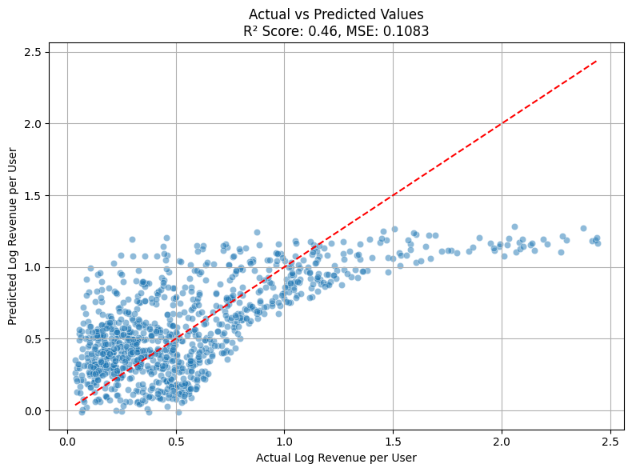
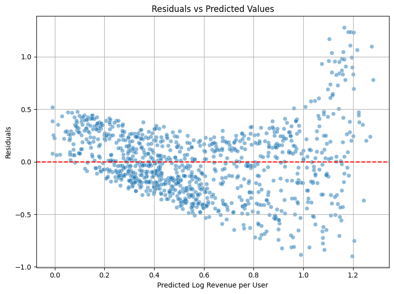

### Gaming Trends 2024: More Than Just Play

**Author: Chaitanya Niranjan Kademane**

#### Executive summary
- This project investigates what factors contributed most to video game success in 2024 by analyzing the interplay engagement, platform preferences, and monetization strategies.
- Using Machine Learning, it segments and predicts monetization performance to derive actionable insights for developers, publishers, marketers, product managers and designers.
- It leverages a real-world dataset from Kaggle and apply both statistical and interpretable ML models to guide strategy and investment decisions in the gaming ecosystem.

#### Rationale
- As the gaming industry becomes increasingly competitive and multi-platform, understanding what derives player spending, retention and visibility is more critical than ever.
- Game studios often struggle with fragmented user data, evolving engagement behaviors and unclear monetization levers.
- This project helps answer: 
  - What makes a game not just popular, but profitable and how can that insight be applied by stakeholders across the industry?
  - What player behaviors indicates strong revenue performance?
  - How do platform and genre interact with monetization outcomes?
  - What features should designers and product managers prioritize in roadmap planning?

By identifying these drivers, stakeholders can make more data-driven decisions about game design, monetization mechanics, user acquisition and content updates.

#### Research Question
What combination of player engagement, platform type and monetization strategies drove game success in 2024 and how can we use Machine Learning to segment, predict and recommend actionable strategies for developers, publishers, marketers, product managers and designers?

#### Data Sources
Kaggle Dataset: [Gaming Trends 2024](https://www.kaggle.com/datasets/anonymous28574/gaming-trends-2024?resource=download)

#### Methodology
- **Exploratory Data Analysis**: 
  - Feature distributions, correlations and genre/platform trends.
- **Feature Engineering**: 
  - Log transforms, revenue per user, engagement bins and scaling.
- **Baseline Models**:
  - _Dummy Regressor_: Statistical baseline
  - _Linear Regression_: Initial predictive model for log_revenue_per_user
- **Model Evaluation**:
  - Mean Squared Error(MSE)
  - R^2 Score
- **Interpretation**:
  - Comparison between actual and predicted RPU (Revenue Per User - converted from log scale)
  - Stakeholders-aligned insights for product, design, developers, publishers and marketing.

#### Results
- The linear regression model explained ~46% of the variance in revenue per user.
- Key predictive feature included DAU, Session Duration, Stream Viewership and In-Game Purchases.
- Dummy model performed poorly (R^2 ~ -0.001), validating the need for meaningful models.
- Segment level insights:
  - Certain genres (e.g., Action, RPG) have stronger monetization patterns on Console and PC.
  - Stream Viewership is a strong leading indicator of monetization potential.
  - Games with high session duration and viewership but low RPU could signal untapped monetization potential.
  - Platform and engagement level differences help guide product and design decisions for feature development and content pricing.

- Key Visuals:

1. Actual vs. Predicted Log Revenue Per User

2. Residuals Plot - diagnosing Linear fit

3. Revenue per User vs. Session Duration (by Platform)

#### Next steps
- Incorporate categorical variables such as genre, engagement and platform into advanced models using one-hot encoding.
- Explore Random Forest, XGBoost or Ridge/Lasso for better generalization and feature interaction analysis.
- Apply interpretability tools such as SHAP to produce clear recommendations for:
  - Product Managers: Prioritize high-monetizing genres and platforms in roadmap planning.
  - Designers: Tailor UI/UX around high engagement touch-points (e.g., longer session features).
  - Marketers: Focus campaigns on genres with high Stream Viewership-Revenue Per User correlation.
  - Developers: align development priorities with genres and platforms that show high monetization potential;
    - Optimize performance for platforms with longer session duration and higher DAU.
  - Publishers: Plan cross-platform distribution and updates based on engagement-monetization alignment.

- Develop a Recommendation Engine:
  - Build stakeholder-aligned strategy outputs using clustering and regression models.
- Audience Segmentation and Classification:
  - Apply clustering(such as KMeans) for behavioral segmentation and use classification models to detect titles at risk of under-performing monetization-wise.

#### Outline of project

- [Data Cleaning & Feature Engineering](notebooks/01_intro_data_cleaning_feature_engineering.ipynb)
- [EDA Visual Analysis](notebooks/02_eda_visual_analysis.ipynb)
- [Modeling Baseline and Beyond](notebooks/03_modeling_baseline_and_beyond.ipynb)

##### Contact and Further Information
This project was submitted as part of the program - "Berkeley Haas | Professional Certificate in Machine Learning and Artificial Intelligence"

For questions, collaboration or more details, feel free to reach out:

- Email: chait.2605@gmail.com
- LinkedIn: [linkedin.com/in/chaitanya-nk](https://www.linkedin.com/in/chaitanya-nk)