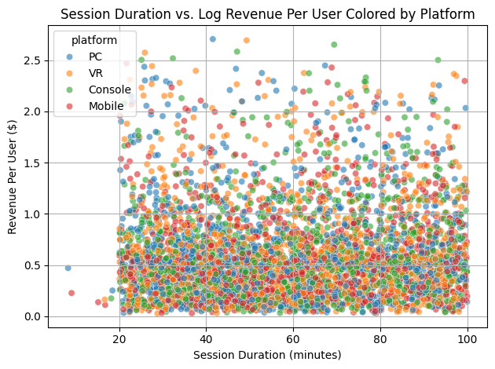
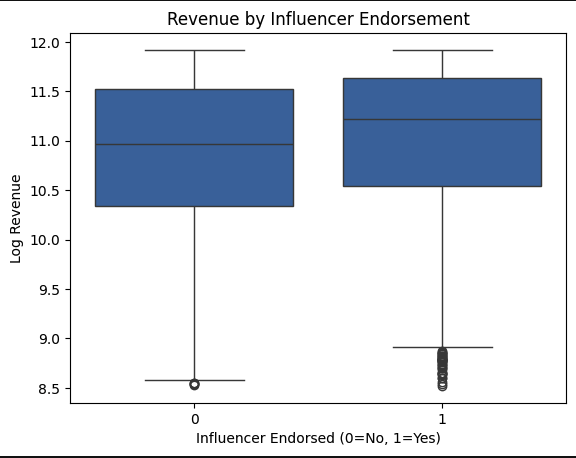
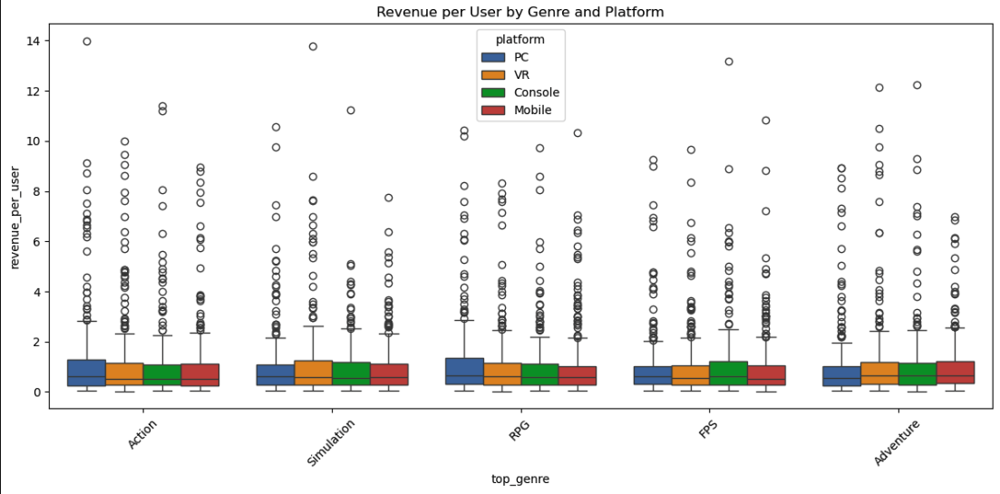
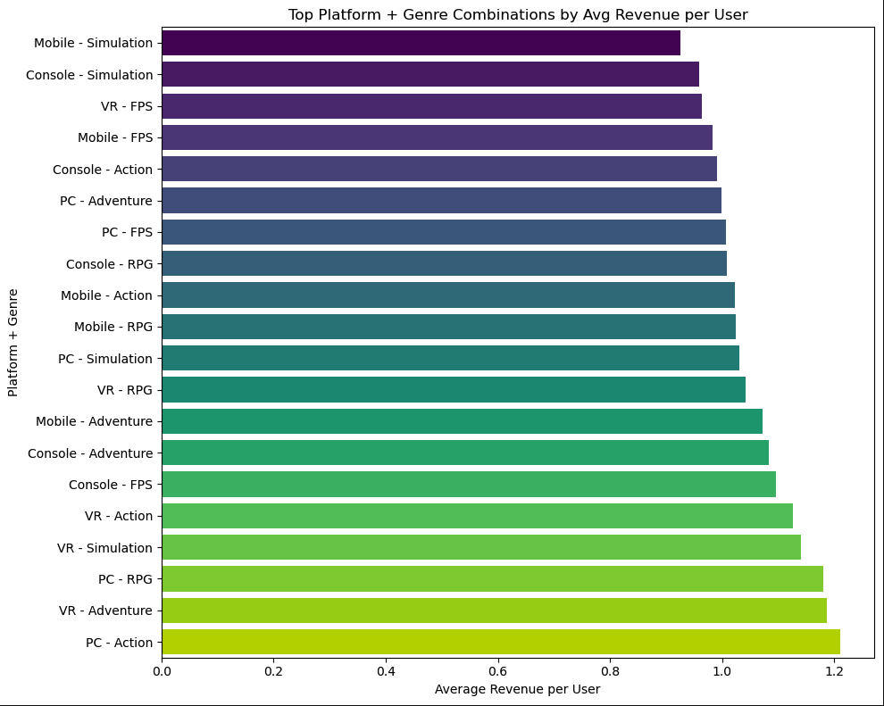
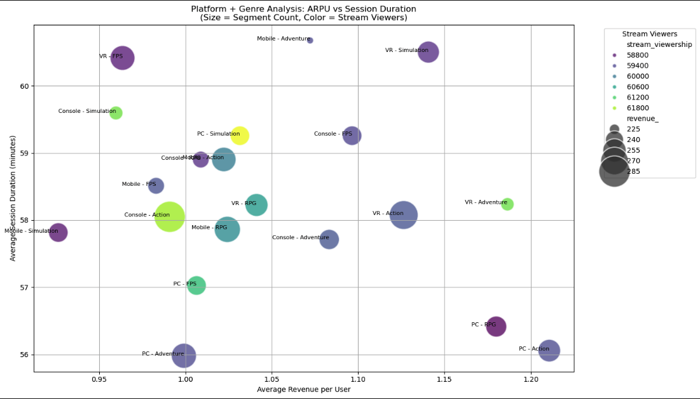
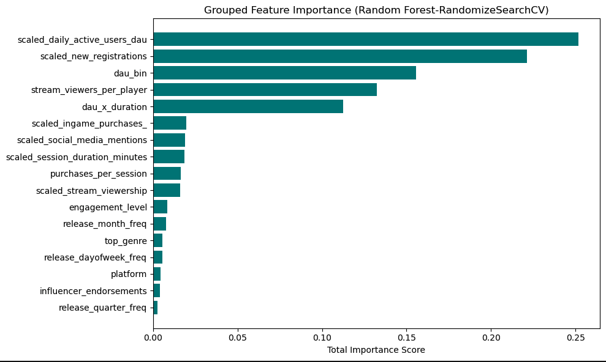
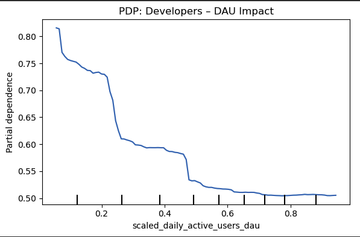
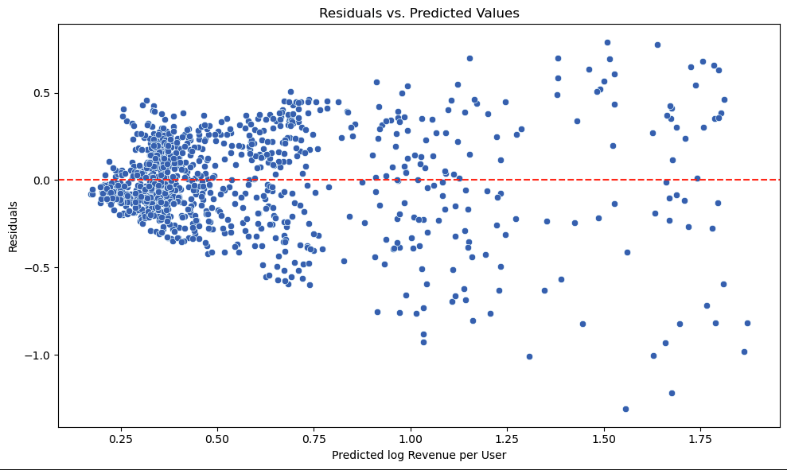
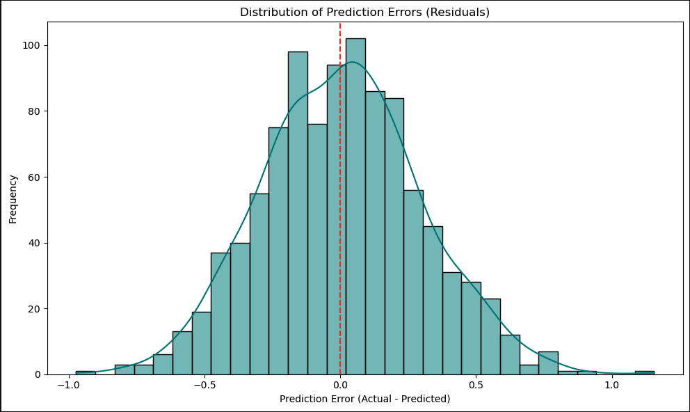

# Gaming Trends 2024: More Than Just Play

**Author: Chaitanya Niranjan Kademane**

     
    <em><i>Image courtesy: [freepik/game analytics illustration]</i></em>

## Executive summary
- This project investigates what factors contributed most to video game success in 2024 by analyzing the interplay engagement, platform preferences, and monetization strategies.
- Using Machine Learning, it segments and predicts monetization performance to derive actionable insights for developers, publishers, marketers, product managers and designers.
- It leverages a real-world dataset from Kaggle and applies both statistical and interpretable ML models to guide strategy and investment decisions in the gaming ecosystem.

## Rationale
- As the gaming industry becomes increasingly competitive and multi-platform, understanding what derives player spending, retention and visibility is more critical than ever.
- Game studios often struggle with fragmented user data, evolving engagement behaviors and unclear monetization levers.
- This project helps answer: 
  - What makes a game not just popular, but profitable and how can that insight be applied by stakeholders across the industry?
  - What player behaviors indicates strong revenue performance?
  - How do platform and genre interact with monetization outcomes?
  - What features should designers and product managers prioritize in roadmap planning?

By identifying these drivers, stakeholders can make more data-driven decisions about game design, monetization mechanics, user acquisition and content updates.

## Research Question
What combination of player engagement, platform type and monetization strategies drove game success in 2024 and how can we use Machine Learning to segment, predict and recommend actionable strategies for developers, publishers, marketers, product managers and designers?

## Dataset Summary
- Source: Kaggle
- Dataset: [Gaming Trends 2024](https://www.kaggle.com/datasets/anonymous28574/gaming-trends-2024?resource=download)
- Size: ~5,000 observations, 10+ features
- Features: Game release date, DAU(Daily Active Users), new registrations, session duration, in-game purchases, platform, top_genre, stream viewership, social media mentions and influencer endorsements.

## Data Cleaning & EDA

Data Cleaning
- The dataset required minimal cleaning.
- Column names were standardized for consistency, and the `influencer_endorsements` column was binarized to distinguish between titles with or without marketing.
- No missing values were found.

Exploratory Data Analysis (EDA)
  - Focused on uncovering monetization drivers across platform and genre dimensions.
- Key steps include:
  - Scatter plot of Session Duration vs. Log transformed Revenue per User to understand monetization efficiency across Platforms.
  
  - Box plot of Revenue by Influencer Endorsements to understand how influencer endorsements drive monetization.
  

These insights informed the construction of stakeholder-aligned features and guided the choice of modeling strategies.

## Feature Engineering
Features were selected and engineered by **reverse-mapping to stakeholder goals**:
- **Developers**: DAU, engagement bins, interaction effects  
- **Marketers**: social media mentions, stream viewership, new registrations  
- **Product Managers**: player behavior bins, release trends  
- **Designers**: session patterns, engagement levels  
- **Publishers**: platform/genre frequency, in-game purchases

Enhanced features include:
- `dau_x_duration`, `purchases_per_session`
- Binned tiers for DAU (Daily Active Users) and RPU (Revenue Per User)
- Behavioral segments
- Frequency of release month/weekday/quarter

In addition to generating derived metrics such as revenue_per_user, log-transformed revenue, 
engagement level bins and interaction features,categorical aggregation was guided by exploratory visualizations.

- Box plot was used to compare Revenue Per User across individual genres and platforms.
  - Highlighting outliers and monetization variability within categories.

- Bar plot was used to visualize top platform + genre combinations by Average Revenue Per User.
  - Provided actionable insights into high-performing segments such as RPG on PC.

- Bubble plot was used to combine Average Revenue Per User and Session Duration for each platform-genre pair.
  - Enabled richer segmentation.
  - Suggested richer monetization efficiency along with player engagement intensity.

These visual insights informed downstream feature encoding and stakeholder strategy mapping.

**Note**: Outliers were retained to preserve monetization signals from high-revenue users and viral patterns, offering more realistic insights.

## Modeling Strategy
### Baseline Models
- **Dummy Regressor** and **Linear Regression** used to set reference scores.

### Advanced Models
- **Random Forest**
  - Random Forest Regressor was selected as a primary modeling approach due to its robustness in handling both categorical
  continuous variables, and its ability to model complex, non-linear relationships without requiring extensive feature transformation.
  - Given the mix og engineered features, Random Forest offered strong performance while maintaining interpretability through feature importance analysis.
  - Cross-validation and hyperparameter tuning via RandomizedSearchCV helped further refine the model, ultimately yielding the best R2 score.
    - GridSearchCV: R² = 0.6282, MSE = 0.0751  
    - RandomizedSearchCV: **R² = 0.6334**, MSE = 0.0741 (Final model)
- **XGBoost**
  - R² = 0.6197, MSE = 0.0768  
  - RandomizedSearchCV: R² = 0.6075, MSE = 0.0793

### Ensemble
- **Voting Regressor**: R² = 0.6280, MSE = 0.0751

### Regularization
- **RidgeCV**: R² = 0.5845  
- **LassoCV**: R² = 0.5848, 18 features selected  

## Model Comparison
| Model                        | Test R²    | Test MSE   |
|-----------------------------|------------|------------|
| Dummy Regressor             | ~0.001     | 0.202      |
| Linear Regression           | ~0.464     | 0.108      |
| RF (GridSearch)             | ~0.628     | 0.0760     |
| RF (RandomSearch)           | ~**0.633** | **0.0741** |
| XGBoost         | ~0.619     | 0.0768     |
| XGBoost (RandomSearch)      | 0.607      | 0.0793     |
| Voting Regressor            | 0.628      | 0.0751     |
| Ridge / Lasso Regression    | ~0.584     | ~0.083     |

* Across all experiments, multiple modeling techniques were applied and evaluated using Test R2 and Test MSE as key performance metrics.

* Despite exploring ensemble and regularization strategies, **RandomForest with RandomizedSearchCV** consistently outperformed other models and delivered the **highest Test R2 of ~63.34%**, with the **lowest MSE of ~0.074.**

* Based on this performance and interpretability, **RandomForest with RandomizedSearchCV has been selected as the final model** for deriving business insights and stakeholder recommendations.

## Interpretability & Insights
### Feature Importance
- Top drivers: DAU, new registrations, stream viewership, session duration and in-game purchases

## Stakeholder Insights by PDP Analysis

**Note:** Only one PDP has been shared here for presentation purpose.
Please find the PDPs for all stakeholder insights in `05_modeling_evaluation_deployment.ipynb` [notebook](notebooks/05_modeling_evaluation_deployment.ipynb).

Stakeholder insights inferred:
- **Developers**: High DAU saturation hints at backend load balancing and retention triggers  
- **Marketers**: Viral spikes in buzz and stream popularity impact revenue in nonlinear ways  
- **PMs**: Low/Medium DAU tiers are strong revenue contributors, while very high DAU can indicate saturation  
- **Designers**: Higher session lengths and engagement levels yield consistent monetization gains  
- **Publishers**: Genre and platform spread impact revenue moderately but predictably

Please find more details about insights in `06_stakeholder_insights_recommender.ipynb` [notebook](notebooks/06_stakeholder_insights_recommender.ipynb).

## Residuals & Error Distribution
- Residuals showed moderate spread.

- Error distribution confirmed mild skew, likely due to high-value outliers—retained for authenticity.

## Conclusion & Future Work
The project successfully demonstrated how interpretable ML models can uncover monetization drivers tailored to stakeholder needs. Random Forest (RandomizedSearchCV) was the final chosen model for its balance of performance and interpretability.

**Next Steps**:
- Build a dashboard(e.g, using Streamlit) to deliver insights interactively to different teams. 
- Automate insight generation using LLMs trained on PDP patterns to reduce manual interpretation.
- Integrate continuous learning using live game metrics  .
- Extend model to predict churn, retention and satisfaction modeling.

## Outline of project

- Notebooks
  - [Data Cleaning & Feature Engineering](notebooks/01_intro_data_cleaning_feature_engineering.ipynb)
  - [EDA Visual Analysis](notebooks/02_eda_analysis_visualization.ipynb)
  - [Baseline Modeling and Evaluation](notebooks/03_modeling_baseline_and_evaluation.ipynb)
  - [Enhanced Feature Engineering](notebooks/04_enhanced_feature_engineering.ipynb)
  - [Advanced Modeling, Evaluation and Deployment](notebooks/05_modeling_evaluation_deployment.ipynb)
  - [Stakeholder Insights Recommender](notebooks/06_stakeholder_insights_recommender.ipynb)

- Data
  - [Original Dataset](data/gaming_trends_2024.csv)
  - [Scaled Data](data/scaled_data_20250520_230548.csv)
  - [Enhanced Features Data](data/enhanced_gaming_trends_data.csv)

## Contact and Further Information
This project was submitted as part of the program - "Berkeley Haas | Professional Certificate in Machine Learning and Artificial Intelligence"

For questions, collaboration or more details, feel free to reach out:

- Email: chait.2605@gmail.com
- LinkedIn: [linkedin.com/in/chaitanya-nk](https://www.linkedin.com/in/chaitanya-nk)